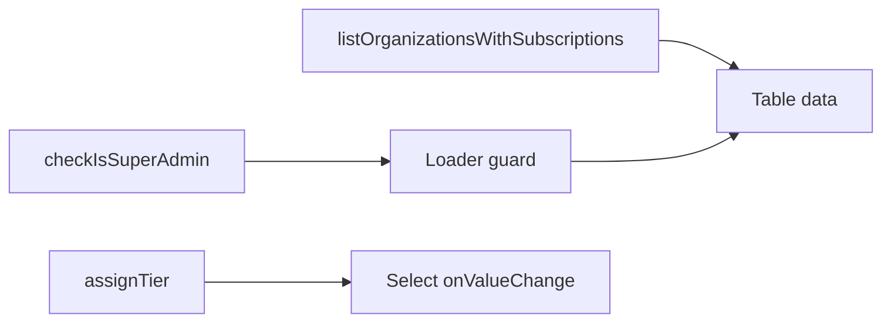

# 0003: Admin subscriptions page

## Context

Super-admin-only page at `/admin/subscriptions`. Table of all organizations with their current tier. Dropdown to assign/change tiers. Non-admins redirected to dashboard.

## Dependencies

- 0002 (checkIsSuperAdmin, listOrganizationsWithSubscriptions, assignTier)

## Files

- `src/routes/_authenticated/admin/subscriptions.tsx` (new)
- `src/lib/constants/navigation.ts` (modify — add `adminSubscriptions` route)

## Requirements

### Route constant

Add to `ROUTES` in `src/lib/constants/navigation.ts`:

```typescript
adminSubscriptions: '/admin/subscriptions',
```

### Route loader

1. Call `getAuth()` to get `authKitId`
2. Prefetch `api.admin.checkIsSuperAdmin` — if `false`, redirect to `/dashboard`
3. Prefetch `api.admin.listOrganizationsWithSubscriptions`

```typescript
export const Route = createFileRoute('/_authenticated/admin/subscriptions')({
  loader: async ({ context }) => {
    const { user } = await getAuth()
    if (!user) throw redirect({ to: '/dashboard' })

    const isSuperAdmin = await context.queryClient.ensureQueryData(
      convexQuery(api.admin.checkIsSuperAdmin, { authKitId: user.id }),
    )
    if (!isSuperAdmin) throw redirect({ to: '/dashboard' })

    await context.queryClient.ensureQueryData(
      convexQuery(api.admin.listOrganizationsWithSubscriptions, {
        authKitId: user.id,
      }),
    )

    return { authKitId: user.id }
  },
  component: AdminSubscriptionsPage,
})
```

### Component

- `useSuspenseQuery` for `listOrganizationsWithSubscriptions`
- Use `useMutation` from `@tanstack/react-query` + `useConvexMutation` for `assignTier`
- Layout: page title "Administrar suscripciones", table below

**Table columns:**

| Column       | Content                                                   |
| ------------ | --------------------------------------------------------- |
| Organización | org name                                                  |
| Slug         | org slug                                                  |
| Plan actual  | `Badge` with `TIER_LABELS[tier]`                          |
| Proveedor    | payment provider (`Stripe`/`Wompi`/`Contrato físico`/`—`) |
| Estado       | status badge or `—`                                       |
| Acción       | `Select` dropdown: free/pro/enterprise                    |

**Select behavior:**

- Value = current tier
- `onValueChange` → call `assignTier` mutation with `{ authKitId, organizationId, tier }`
- Disable while mutation is pending
- Use existing shadcn `Table`, `Select`, `Badge` components

### Dependency diagram



## No-gos

- No pagination — admin page, org count is small
- No search/filter — keep it simple
- No confirmation dialog — tier change is instant and reversible

## Definition of Done

- [ ] Route accessible at `/admin/subscriptions` for super admins
- [ ] Non-super-admin redirected to `/dashboard`
- [ ] Table displays all orgs with current tier, provider, status
- [ ] Select dropdown changes tier via `assignTier` mutation
- [ ] UI updates reactively after mutation
- [ ] `adminSubscriptions` added to `ROUTES` constant
- [ ] No TypeScript errors
